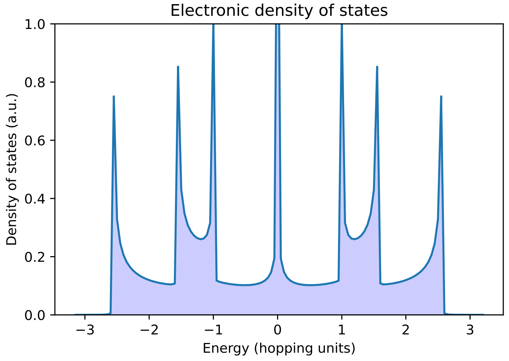

# GreenPy

The package implements a class to handle different calculations to obtain the electronic density of states of a nanomaterial. The code is based on the iterative use of the Dyson equation through a process called "dressing up" or "decimation." It is assumed the system is periodic along the axial axis.

## Quick start

Clone the repo: `https://github.com/chinchay/GreenPy.git`

## What's included

Ready to use methods are available: `get_density_OneLinearChain()` and `get_density_smallestZGNR()` to calculate and display the electronic density of a linear chain of atoms and for the smallest zigzag graphene nanoribbon, respectively.


```python
import numpy as np
from green import Green
import matplotlib.pyplot as plt

energy_list  = np.arange(-3.15, 3.25, 0.05)
density_list = []
for energy in energy_list:
    dens = Green.get_density_smallestZGNR(energy)
    density_list.append( dens )
#
Green.plot(energy_list, density_list)
```




Further code development is under work. The `src` folder contains a performance comparison between Numpy and LAPACK functions. Unit test is also available.

## Under development

* A future release will connect the code to ASE objects and calculators
* Hubbard terms will be included to account for electronic correlation


## References
* E. Economou. *Green’s Functions in Quantum Physics*. Springer, 2006. 11, 12, 70
* M. Di Ventra. *Electrical Transport in Nanoscale Systems*, 1st edition, pp 150. Cambridge University Press, 2008. 73


## Copyright and license

Code released under the MIT License