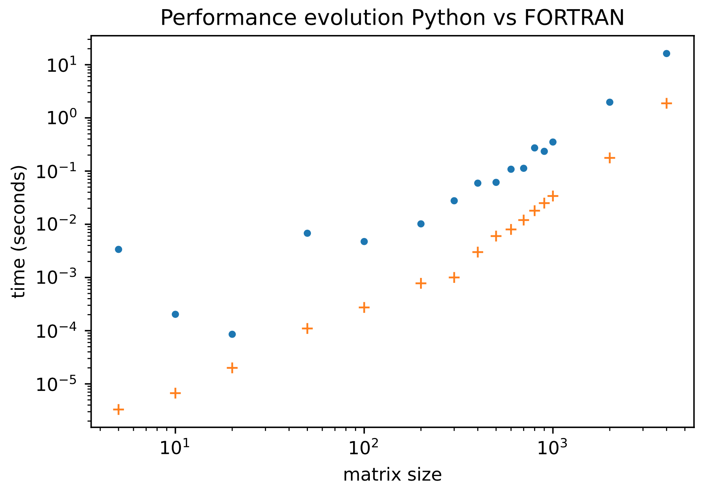

# Performance history

`Line_profiler` can analyze the time spent at each line. Information can be found [here](https://github.com/rkern/line_profiler#kernprof) and [here](https://towardsdatascience.com/how-to-assess-your-code-performance-in-python-346a17880c9f). To install it, type the following:

```ShellSession
$ pip install line_profiler
```


## `renormalize()` profile
It would be required to add the decorator `@profile` before the code definition. 


Now, `kernprof` command will be available. Type the following in the directory where the file resides (in this case, `cd src/`):

```ShellSession
$ kernprof -l utils.py
```

A file `*.lprof`will be created. To display results type

```ShellSession
$ python -m line_profiler utils.py.lprof
```

Results:
```
Timer unit: 1e-06 s

Total time: 0.011452 s
File: drafts.py
Function: renormalize at line 70

Line #      Hits         Time  Per Hit   % Time  Line Contents
==============================================================
    70                                           @profile
    71                                           def renormalize(Z, Q):
    72         1         11.0     11.0      0.1      size = Q.shape[0]
    73         1         51.0     51.0      0.4      ident = np.eye(size, dtype=complex)
    74         1         34.0     34.0      0.3      temp = ident - Z
    75         1      10667.0  10667.0     93.1      inversa = np.linalg.inv( temp )
    76         1        687.0    687.0      6.0      renormalized = np.matmul(inversa, Q)
    77         1          2.0      2.0      0.0      return renormalized
```

```
Total time: 0.0117 s
File: utils.py
Function: renormalize_solve at line 13

Line #      Hits         Time  Per Hit   % Time  Line Contents
==============================================================
    13                                           @profile
    14                                           def renormalize_solve(Z, Q):
    15        20         30.0      1.5      0.3      size = Q.shape[0]
    16        20        418.0     20.9      3.6      ident = np.eye(size, dtype=complex)
    17        20        347.0     17.4      3.0      temp = ident - Z
    18        20      10891.0    544.5     93.1      renormalized = np.linalg.solve(temp, Q)
    19        20         14.0      0.7      0.1      return renormalized
```


Here is the piece of code, after improving performance. Notice that now I use `solve()` instead of `linalg.solve()` to speed up the code further.

`utils.py`

```python
import numpy as np
from numpy.linalg import solve
from numpy import matmul

@profile
def renormalize(Z, Q):
    size = Q.shape[0]
    ident = np.eye(size, dtype=complex)
    temp = ident - Z
    renormalized = solve(temp, Q)
    return renormalized
#

size    = 20
energy  = -2.0
delta   = 0.01
invE    = 1 / complex(energy, delta)
ident   =  np.eye(size, dtype=complex)
g       = invE * ident.copy()
t00     = ident.copy()
t       = ident.copy()
td      = ident.copy()
r_solve = renormalize(g, g) # just a toy example
```


## `decimate()` profile

Still, `renormalize()` takes most of the time in the decimation process, about 10X of any other operation.

```
$ kernprof -l utils.py
Wrote profile results to utils.py.lprof
$ python -m line_profiler utils.py.lprof
Timer unit: 1e-06 s

Total time: 0.000633 s
File: utils.py
Function: decimate at line 14

Line #      Hits         Time  Per Hit   % Time  Line Contents
==============================================================
    14                                           @profile
    15                                           def decimate(greenFunction, t00, t, td):
    18         1         59.0     59.0      9.3      temp = matmul(greenFunction, t00)
    20         1        289.0    289.0     45.7      GR  = renormalize(temp, greenFunction)
    21         1          2.0      2.0      0.3      TR  = t
    22         1          1.0      1.0      0.2      TRD = td
    23
    24         1          1.0      1.0      0.2      n = 1 #15
    25         2          4.0      2.0      0.6      for i in range(n):
    26         1         23.0     23.0      3.6          Z   = matmul( GR, TR  )               # Z(N-1)   = GR(N-1)*TR(N-1)
    27         1         17.0     17.0      2.7          ZzD = matmul( GR, TRD )               # ZzD(N-1) = GR(N-1)*TRD(N-1)
    28         1         28.0     28.0      4.4          TR  = matmul( matmul(TR, GR), TR )    # TR(N)    = TR(N-1)*GR(N-1)*TR(N-1)
    29         1         18.0     18.0      2.8          TRD = matmul( matmul(TRD, GR), TRD )  # TRD(N)   = TRD(N-1)*GR(N-1)*TRD(N-1)
    30         1        190.0    190.0     30.0          GR  = renormalize( matmul(Z, ZzD) + matmul(ZzD,Z), GR )
    31                                               #
    32         1          1.0      1.0      0.2      return GR
```


## Python (NUMPY) vs FORTRAN (LAPACK)

First, install LAPACK:

```ShellSession
$ brew install lapack
```

The fortran code was compiled as

```ShellSession
$ gfortran algebra.f90 -llapack
```
Data were collected by averaging the time taken at several loops containing the `renormalize()` function for both, Python and FORTRAN.

Even with the use of the NUMPY (ultimately based on LAPACK or BLAS) for Python, the code is 10X slower than its FORTRAN counterpart (see Fig.1)



__Figure 1__. Time vs matrix size employed in the `renormalize()` function, using `numpy.linalg.solve()` for Python and `dgesv()` from LAPACK for FORTRAN. Performed on a 1.6 GHz Dual-Core Intel Core i5 processor, 8 GB 2133 MHz LPDDR3


__Python code__

```python
import numpy as np
from numpy.linalg import solve
import time

def renormalize(Z, Q, size):
    size = Q.shape[0]
    ident = np.eye(size, dtype=complex)
    temp = ident - Z
    renormalized = solve(temp, Q)
    return renormalized
#

nTimes = 20
size_list = [5, 10, 20, 50, 100, 200, 300, 400, 500, 600, 700, 800, 900, 1000]
time_list = []

for size in size_list:
    eye    = np.eye(size, dtype=complex)
    energy = -2.0
    delta  = 0.01
    invE   = 1 / complex(energy, delta)
    g      = invE * eye
    t00    = eye.copy()
    t      = eye.copy()
    td     = eye.copy()

    r_solve = renormalize(g, g, size) # just a toy example
    
    start_time = time.time()
    for _ in range(nTimes):
        r_solve = renormalize(g, g, size) # just a toy example
    #
    end_time = time.time()
    delta = (end_time - start_time) / nTimes
    time_list.append( delta )
#
```

__FORTRAN code__


`algebra.f90`

```fortran
program algebra
    implicit none
    integer :: i, j, size
    real(8) :: energy, delta
    complex(8) :: invE
    complex(8), allocatable, dimension(:,:) :: eye, g, t00, t, td, r_solve
    integer :: time_start, time_end, nTimes
    integer, parameter :: nSizes = 14
    integer, dimension(nSizes) :: size_list

    energy  = -2.0
    delta   = 0.01
    invE    = 1 / dcmplx( energy, delta )
    size_list = (/ 5, 10, 20, 50, 100, 200, 300, 400, 500, 600, 700, 800, 900, 1000 /)

    do j = 1, nSizes
      size = size_list(j)
      eye  = getEye(size)
      g    = invE * eye
      t00  = eye
      t    = eye
      td   = eye

      time_start = getTime()
      nTimes = 100
      do i = 1, nTimes
        r_solve = renormalize(g, g, size) ! just a toy example
      enddo
      time_end = getTime()
      call displayTimeElapsed(time_start, time_end, nTimes)
    enddo

    contains

    !---------------------------------------------------------------
    function renormalize(zetas, q, n) result(r)
        implicit none
        integer,    intent(in) :: n
        complex(8), dimension(n, n), intent(in)  :: zetas, q
        complex(8), dimension(n, n) :: temp1, temp2, eye, r
        eye = getEye(n)
        temp1 = eye - zetas
        r = q
        ! Solve the system `temp1 * X = r`, overwriting r with X
        call solve(temp1, r, n)
    end function

    !---------------------------------------------------------------
    subroutine solve(a, b, size)
        implicit none
        ! DGESV computes the solution to system of linear equations A * X = B for GE matrices
        ! Solve the system A*X = B, overwriting B with X.
        integer, intent(in) :: size
        integer :: n, nrhs, lda, ldb, info
        complex(8), dimension(size, size) :: a
        complex(8), dimension(size, size) :: b
        integer, dimension(size) :: ipiv
        n    = size
        nrhs = size
        lda  = n
        ldb  = n
        call dgesv(n, nrhs, a, lda, ipiv, b, ldb, info)
    end subroutine

    !---------------------------------------------------------------
    function getTime() result(current_milisecond)
        implicit none
        integer, dimension(8) :: values
        integer :: current_milisecond, min2milisec, sec2milisec
        call date_and_time(VALUES=values)
        min2milisec = values(6) * 1000 * 60
        sec2milisec = values(7) * 1000 
        current_milisecond = min2milisec + sec2milisec + values(8)
    end function

    !---------------------------------------------------------------
    subroutine displayTimeElapsed(time_start, time_end, nTimes)
        implicit none
        integer, intent(in) :: time_start, time_end, nTimes
        real :: delta
        delta = 1.0 * (time_end - time_start) / nTimes
        write(*, *) delta
    end subroutine

    !---------------------------------------------------------------
    function getEye(size) result(eye)
        implicit none
        integer, intent(in) :: size
        complex(8), dimension(size, size) :: eye
        integer :: i
        eye = 0.0
        do i = 1, size
          eye(i, i) = 1.0
        enddo
    end function
end program
```


